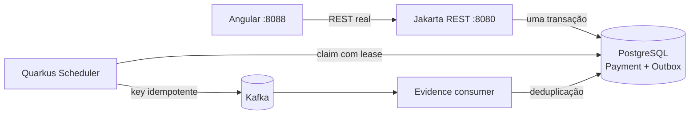

# Transactional Outbox Worker

Laboratório vertical em Java 21, Quarkus 3.33 LTS, PostgreSQL, Kafka e Angular 22.1 para demonstrar entrega de eventos `at-least-once` sem esconder a janela de duplicação. O projeto é voltado a estudo e entrevistas Senior; não processa cartões reais.

## O problema demonstrado

`POST /api/payments` grava o pagamento e `PaymentAuthorized.v1` na mesma transação PostgreSQL. O handler HTTP não fala com Kafka. Um scheduler reclama mensagens com lease e `FOR UPDATE SKIP LOCKED`, publica usando uma chave idempotente e só então marca `PUBLISHED`. Se Kafka falhar, a tentativa, o erro e o próximo retry ficam persistidos. Um consumidor do próprio tópico grava uma evidência deduplicada.



## Executar localmente

Pré-requisito: Docker com Compose v2.

```bash
docker compose up --build -d
```

- Console Angular: [http://localhost:8088](http://localhost:8088)
- OpenAPI/Swagger UI: [http://localhost:8080/q/swagger-ui](http://localhost:8080/q/swagger-ui)
- Health: [http://localhost:8080/q/health](http://localhost:8080/q/health)
- Métricas Prometheus: [http://localhost:8080/q/metrics](http://localhost:8080/q/metrics)

No console, autorize um pagamento e atualize até observar `PUBLISHED` e uma evidência consumida. Clique em **Falhar próxima publicação** antes de autorizar para observar `PENDING`, erro persistido, backoff e recuperação.

Para parar sem apagar o volume PostgreSQL:

```bash
docker compose down
```

## Contratos

- `POST /api/payments`, com header obrigatório `Idempotency-Key`: cria `201`; repetição idêntica retorna `200`; mesma chave com outro payload retorna Problem Details `409`.
- `GET /api/operations/snapshot`: pagamentos, mensagens e evidências consumidas para o laboratório.
- `POST /api/operations/fail-next-publication`: arma uma única falha determinística, exclusiva da superfície de estudo.
- Evento Kafka `PaymentAuthorized.v1`: tópico `payment-authorized`, chave `payment-authorized:{Idempotency-Key}` e schema em `contracts/payment-authorized.v1.schema.json`.

As APIs são descritas pelo OpenAPI gerado pelo SmallRye. Erros de validação usam `application/problem+json`, e toda resposta inclui `X-Correlation-ID`.

## Verificação

```bash
JAVA_HOME=/opt/homebrew/opt/openjdk@21 ./gradlew test
PATH=/opt/homebrew/opt/node@24/bin:$PATH npm --prefix frontend ci
PATH=/opt/homebrew/opt/node@24/bin:$PATH npm --prefix frontend run test:ci
PATH=/opt/homebrew/opt/node@24/bin:$PATH npm --prefix frontend run build
docker compose config --quiet
./scripts/audit-history.sh
```

Os testes backend iniciam PostgreSQL e Kafka reais por Quarkus Dev Services/Testcontainers. CI equivalente está disponível para GitHub Actions, Jenkins e GitLab CI.

## Decisões defendíveis em entrevista

- **Outbox antes do broker:** banco e Kafka não compartilham commit; a intenção durável evita perda silenciosa.
- **At-least-once, não exactly-once:** uma queda após o ack Kafka e antes do update PostgreSQL pode repetir o evento.
- **Claim por lease:** `SKIP LOCKED` distribui lotes entre réplicas; a expiração recupera trabalho abandonado.
- **Idempotência nas duas fronteiras:** a API deduplica a requisição e o consumidor deduplica o efeito por chave Kafka.
- **Backoff persistido:** reiniciar o processo não apaga tentativa, erro nem agendamento.
- **UI mínima:** Angular só chama contratos reais e torna estados intermediários visíveis; regras continuam no backend.

Leia os [ADRs](docs/adr/) para os trade-offs e o [runbook](docs/runbook.md) para diagnóstico e recuperação.
